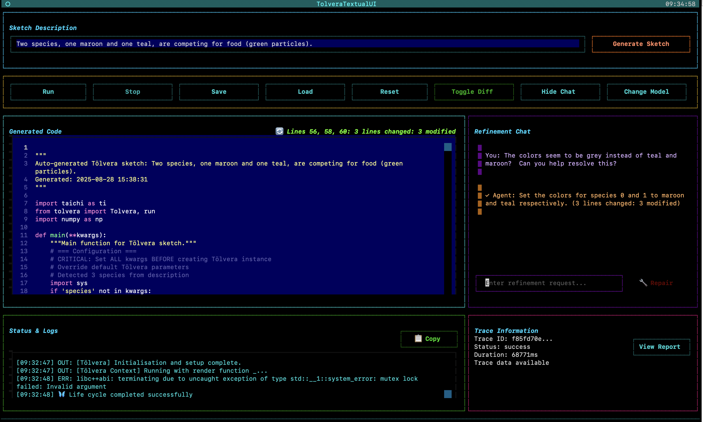

# LLM Module

## Introduction

The LLM module provides a code generation engine for Tölvera that synthesizes particle-based behaviors and visual effects from natural language descriptions. This module transforms user descriptions into executable Taichi GPU kernels and functions, using language models to generate physics simulations, particle interactions, and behaviors for artificial life simulations.

## Architectural Overview

The system processes natural language through a multi-stage pipeline with specialized components:

### Processing Phases

1. **Analysis Phase**: The BehaviorAnalyzer examines natural language descriptions to identify species, required states, and decompose complex behaviors into implementable components.

2. **Orchestration Phase**: The BehaviorOrchestrator coordinates the synthesis process, managing state creation, component generation, and expert registration.

3. **Code Generation Phase**: The CodeGenerator synthesizes Taichi kernel functions based on analyzed components, using dynamic context selection.

4. **Template Rendering Phase**: The TemplateRenderer assembles generated code into complete, executable sketches using Jinja2 templates.

5. **Refinement Phase**: The SketchRefiner applies architectural patterns and corrections to ensure generated code follows established practices.

## Key Components

### Core Orchestration and Synthesis

| Component                | File                            | Responsibility                                                                                                     |
| ------------------------ | ------------------------------- | ------------------------------------------------------------------------------------------------------------------ |
| **BehaviorOrchestrator** | `core/behavior_orchestrator.py` | Coordinates the synthesis pipeline, delegates tasks to specialized components, and maintains workflow state        |
| **CodeGenerator**        | `core/code_generator.py`        | Generates Taichi expert functions from descriptions using structured outputs, handles state analysis and synthesis |
| **BehaviorAnalyzer**     | `core/behavior_analyzer.py`     | Decomposes behavior descriptions into components, identifies species configurations and required states            |
| **SketchRefiner**        | `core/sketch_refiner.py`        | Applies architectural patterns and refinements to generated sketches for code quality                              |

### Data Models and Registry

| Component            | File                        | Responsibility                                                                                                  |
| -------------------- | --------------------------- | --------------------------------------------------------------------------------------------------------------- |
| **DataModels**       | `core/data_models.py`       | Pydantic models for behavior synthesis requests/responses, expert functions, states, and species configurations |
| **BehaviorRegistry** | `core/behavior_registry.py` | Maintains registry of synthesized expert functions with types, weights, and species associations                |

### State and Species Management

| Component          | File                      | Responsibility                                                                                    |
| ------------------ | ------------------------- | ------------------------------------------------------------------------------------------------- |
| **StateManager**   | `core/state_manager.py`   | Manages custom particle and global states, tracks available fields, generates initialization code |
| **SpeciesManager** | `core/species_manager.py` | Analyzes descriptions for species mentions, manages configurations and initialization patterns    |

### Context and Prompt Management

| Component           | File                          | Responsibility                                                                         |
| ------------------- | ----------------------------- | -------------------------------------------------------------------------------------- |
| **ContextSelector** | `context/context_selector.py` | Dynamically selects relevant documentation and patterns based on behavior descriptions |
| **PromptLoader**    | `prompts/prompt_loader.py`    | Manages prompt templates with variable substitution and dynamic prompt building        |

### Template and Rendering

| Component            | File                             | Responsibility                                                       |
| -------------------- | -------------------------------- | -------------------------------------------------------------------- |
| **TemplateRenderer** | `templates/template_renderer.py` | Renders code from Jinja2 templates for kernels and complete sketches |

### Additional Components

| Component               | File                           | Responsibility                                                     |
| ----------------------- | ------------------------------ | ------------------------------------------------------------------ |
| **ColorResolver**       | `core/color_resolver.py`       | Maps color descriptions to RGBA values for species-specific colors |
| **ConversationManager** | `core/conversation_manager.py` | Manages conversation state and history for interactive sessions    |
| **LLMFactory**          | `core/llm_factory.py`          | Factory for creating model instances across different providers    |

## Directory Structure

### prompts/

Structured prompt templates organized by functionality:

- **decomposition/**: Behavior analysis and decomposition templates
- **synthesis/**: Code generation and expert synthesis templates
- **refinement/**: Code refinement and error correction templates
- **context_selector/**: Intelligent context selection templates
- **utilities/**: Helper templates for specific tasks

### context/

Domain knowledge and patterns for code generation:

- **library_docs.py**: Core API documentation and usage patterns
- **patterns.py**: Common particle behavior patterns
- **taichi_patterns.py**: Taichi-specific programming patterns
- **alife_patterns.py**: Artificial life simulation patterns
- **drawing_patterns.py**: Visual effect and rendering patterns
- **vera_patterns.py**: T�lvera-specific implementation patterns
- **temporal_dynamics.py**: Time-based behavior patterns
- **exemplars/**: Complete working examples

### templates/

Jinja2 templates for code generation:

- **kernel/**: Integration, drawing, and utility kernel templates
- **sketch/**: Complete sketch file templates
- **state/**: State initialization templates
- **init/**: Particle initialization templates

## Usage

### API Configuration

1. Copy the environment template:

   ```bash
   cp .env.example .env
   ```

2. Add API keys to the `.env` file:
   ```
   GEMINI_API_KEY=your-key-here      # Google Gemini
   OPENAI_API_KEY=your-key-here      # OpenAI GPT models
   ANTHROPIC_API_KEY=your-key-here   # Claude models
   MISTRAL_API_KEY=your-key-here     # Mistral models
   ```

### Textual User Interface



**Demo Video**: Watch a comprehensive overview of the LLM system capabilities and Google Summer of Code 2025 achievements: [Tölvera LLM Demo](https://www.youtube.com/watch?v=jllyR3wAETc)

<iframe width="560" height="315" src="https://www.youtube.com/embed/jllyR3wAETc" title="Tölvera LLM Demo" frameborder="0" allow="accelerometer; autoplay; clipboard-write; encrypted-media; gyroscope; picture-in-picture" allowfullscreen></iframe>

Launch the interactive terminal UI:

```bash
poetry run python src/tolvera/llm/ui_scripts/tolvera_textual_ui.py
```

Features include:

- Interactive behavior input with autocomplete
- Real-time code generation and preview
- Model selection across configured providers
- Sketch management (save/load/export)
- Help system (F1) and tutorial (F2)
- Chat panel for iterative refinement
- Diff viewer for code changes

### Command-Line Demo

Run the demo to explore capabilities:

```bash
poetry run python src/tolvera/llm/ui_scripts/tolvera_llm_demo.py
```

The demo includes:

- Single-particle behaviors
- Multi-component behaviors with decomposition
- Visual effects and drawing behaviors
- Multi-species ecosystem interactions
- Automatic state generation
- Artificial life pattern synthesis

## Example Behaviors

### Simple Behaviors

```
"Particles are attracted to the center"
"Add gravity and boundary collisions"
"Particles randomly walk around the screen"
```

### Species Interactions

```
"Red predators chase blue prey"
"Three species form a rock-paper-scissors dynamic"
"Green algae grows while being eaten by fish"
```

### Complex Ecosystems

```
"Fish school together and avoid sharks"
"Implement Conway's Game of Life with particles"
"Slime mold simulation with nutrient seeking"
```

### Visual Effects

```
"Particles leave glowing trails"
"Draw connections between nearby particles"
"Create pulsing halos around each species"
```

## Key Features

### Interactive Textual UI

A terminal-based interface built with Textual providing behavior input, code preview, model selection, and sketch management.

### HTML Trace Reporting

Interactive HTML reports for debugging and analysis including:

- Hierarchical trace visualization
- Timing metrics for each component
- LLM call details and token usage
- State and species analysis results
- Generated code at each stage

## Architecture Highlights

### Pipeline Orchestration

The BehaviorOrchestrator coordinates specialized agents, each handling specific synthesis aspects. This separation of concerns supports modularity and maintainability.

### Dynamic Context Selection

An LLM-powered context selector chooses relevant documentation and patterns based on the behavior being synthesized, improving generation quality over static templates.

### Structured Output Generation

All LLM interactions use Pydantic models for structured output, ensuring consistent code generation.

### Template-Based Code Assembly

Jinja2 templates separate code structure from generation logic for consistent output formatting.

## Development

### Adding New Behaviors

To extend behavior types:

1. Add pattern examples to context files in `context/`
2. Create or modify prompt templates in `prompts/synthesis/`
3. Update BehaviorAnalyzer for new decomposition patterns

### Extending Model Support

Add new LLM providers by:

1. Implementing the provider in `core/llm_factory.py`
2. Adding model configuration
3. Ensuring structured output compatibility

### Custom Templates

Add new templates to `templates/` following Jinja2 patterns, with corresponding methods in TemplateRenderer.

## Performance Considerations

- Context selection minimizes token usage
- Faster inference models improve interactive experience
- Template-based generation ensures consistent performance

## Current Capabilities and Limitations

### Capabilities

- Basic behavior synthesis (gravity, movement, forces)
- Interaction behaviors (chase, flock, repel)
- Drawing behaviors (trails, glows, effects)
- Complete sketch generation
- Automatic species detection and configuration
- Automatic state generation for complex behaviors
- Complex behavior decomposition
- Comprehensive tracing with HTML reports
- Multi-provider LLM support
- Artificial life pattern recognition

## Demo System

The demo (`ui_scripts/tolvera_llm_demo.py`) showcases major features:

### Available Demonstrations

1. **Basic Behaviors** - Particle physics with single expert synthesis
2. **Complex Behaviors** - Decomposition with multi-component behaviors
3. **Drawing Effects** - Visual trails and glows
4. **Species Interactions** - Multi-species ecosystems
5. **Species Detection** - Automatic species analysis
6. **State Generation** - Automatic state creation
7. **Artificial Life Patterns** - Classic behaviors and emergent patterns
8. **Custom Input** - Interactive behavior creation

### Output Files

Generated sketches saved to:

- `examples/generated_sketches/` - Python sketch files
- `examples/generated_sketches/traces/` - Debug traces
  - `.json` - Raw trace data
  - `.html` - Interactive reports
  - `.md` - Mermaid diagrams

### Tracing System

Tracing includes:

- Real-time console output
- JSON traces for analysis
- Interactive HTML reports
- Mermaid flow diagrams
- LLM call tracking and metrics
